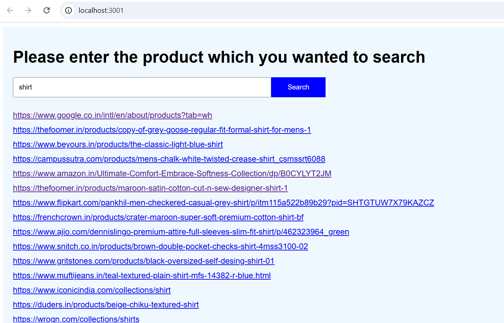

# Getting Started with Web Crawler

## We have used below technologies in this project

Node.js: A JavaScript runtime that lets you run JavaScript server-side.\
Express: A Node.js framework for building server-side applications and APIs.\
Puppeteer: A Node library for controlling headless browsers, ideal for web scraping.\
React: A JavaScript library for building frontend user interfaces.

## To run backend run below commands
Install the dependencies using below command:

### `npm install`

Start your Express server by running below command in src folder:

### `node server.js`

## To run frontend run follow below steps

Go to the folder crawler-frontend and install dependencies using below command.

### `npm install`

Start your react server by running:

### `npm start`

Runs the app in the development mode.\
Open [http://localhost:3000 or http://localhost:3001](http://localhost:3000) to view it in your browser.

The page will reload when you make changes.\
You may also see any lint errors in the console.

Once web browser is active search the product which you wanted in the search bar and click on Search button. It will list the available url's for the particular product like below.

